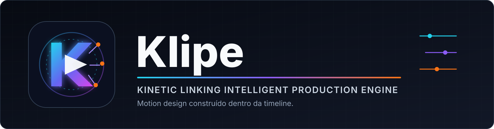
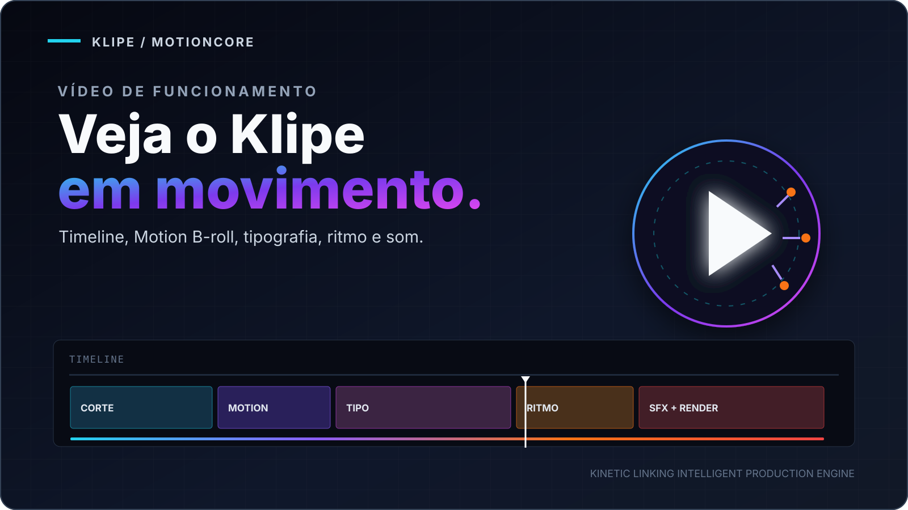

<p align="center">
  
</p>

<p align="center">
  <strong>Não é só edição. É movimento construído dentro da timeline.</strong>
</p>

<p align="center">
  
  
  
  
  
</p>

## O Klipe

Klipe é um editor de vídeo local com timeline multipista no navegador e um
motor próprio de motion design em Python/Skia. Preview, composição e render
vivem no mesmo fluxo para aproximar o que você vê do arquivo final.

## Veja o Klipe em ação

<p align="center">
  <a href="https://youtu.be/EPf02R5D8Rs">
    
  </a>
</p>

<p align="center">
  <a href="https://youtu.be/EPf02R5D8Rs"><strong>Assistir à demonstração no YouTube</strong></a> · 1 minuto · Full HD
</p>

Motion B-roll, gráficos animados, tipografia cinética, zooms, transições e
SFX: veja diferentes estilos reunidos em um vídeo editado e renderizado no
Klipe. Demonstração publicada no canal **Xang TV**.

## Quatro pilares

| Pilar | No Klipe |
| --- | --- |
| **Composição** | Motion B-roll, formas, camadas, máscaras e enquadramento |
| **Tipografia** | Títulos cinéticos, legendas e presets editáveis |
| **Ritmo** | Cortes, zooms, transições e animações guiadas pela timeline |
| **SFX** | Efeitos, música, voz e mixagem no preview e no render |

## Recursos

- Timeline multipista para vídeo, Motion B-roll, títulos, legendas e áudio
- MotionCore com render em Skia e composição final por FFmpeg
- Preview local sem depender de nuvem para a edição básica
- Projetos isolados em `public/projects/<slug>`
- Salvamento manual por **Save** ou `Ctrl+S`
- Importação local e por URL, transcrição e busca opcional de B-roll
- Integrações opcionais com Veo e Omni, configuradas apenas na máquina local
- Launchers para Windows e macOS

## Começo rápido

### Windows

1. Instale [Node.js 20+](https://nodejs.org/), Python 3.11 e FFmpeg.
2. Execute `Iniciar Klipe.bat`.
3. Abra `http://127.0.0.1:3002` caso o navegador não abra sozinho.

O launcher verifica o ambiente Python, as dependências Node e o FFmpeg antes
de iniciar o editor.

### macOS

```bash
brew install node python ffmpeg
npm install
python3 -m pip install -r requirements.txt
chmod +x "Iniciar Klipe.command"
./Iniciar\ Klipe.command
```

O núcleo do editor e o MotionCore funcionam no macOS. Integrações nativas como
NVENC, Explorer e automações do DaVinci podem exigir adaptação ao sistema.

### Execução manual

```bash
npm install
python -m pip install -r requirements.txt
npm start
```

## Primeiro projeto

O repositório começa sem vídeos nem projetos de clientes. Abra o Klipe, crie
um projeto e importe uma mídia. Cada projeto recebe seu próprio
`edit_config.json` e pode ser acessado em `/p/<slug>`.

## Arquitetura

```text
editor.html              interface, preview e estado da timeline
editor-server.js         servidor local, projetos e processos de render
motioncore/              composição e animação em Python/Skia
forge_render.py          render final e mixagem com FFmpeg
public/klipe_player.js   player do preview
public/projects/         projetos locais ignorados pelo Git
```

Veja [docs/ARCHITECTURE.md](docs/ARCHITECTURE.md) para o fluxo completo.

## Configuração

Copie somente as variáveis necessárias de `.env.example` para o seu ambiente.
Chaves e configurações locais também podem ser definidas pela interface e são
armazenadas fora do Git.

## Desenvolvimento

```bash
npm run check
python -m compileall -q motioncore
```

Pull requests passam por uma checagem automática de sintaxe e JSON. Consulte
[CONTRIBUTING.md](CONTRIBUTING.md) antes de alterar contratos da timeline ou do
render.

## Privacidade

Vídeos, áudios, renders, bancos, chaves, fontes de terceiros e projetos de
trabalho são ignorados pelo Git. Antes de publicar qualquer mídia, confirme os
direitos de uso do conteúdo e das pessoas que aparecem nele.

## Licença

O Klipe é software proprietário. A visibilidade ou o acesso ao repositório não
concede permissão para copiar, redistribuir, sublicenciar ou revender o código.
Consulte [LICENSE](LICENSE).
